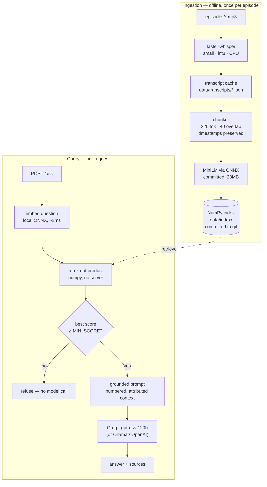

# Ask the Commit

Question answering over a podcast archive, grounded in the actual transcripts.

Ask something, get an answer with a citation to the episode and timestamp it came
from. Ask something the archive doesn't cover and the service says so instead of
inventing an answer.

```console
$ curl -s localhost:8000/ask -H 'content-type: application/json' \
    -d '{"question": "Why does Kushal think privacy is a human right?"}' | jq -c

{
  "answer": "Kushal says privacy is extremely important in today's modern world,
             where computers and new technologies constantly threaten personal
             data, so people need reminding of its importance [1].",
  "sources": [
    {"episode": "Privacy and Surveillance - Kushal Das", "timestamp": "0:00", "score": 0.591},
    {"episode": "Privacy and Surveillance - Kushal Das", "timestamp": "35:32", "score": 0.506}
  ],
  "refused": false,
  "latency_ms": 1157
}

$ curl -s localhost:8000/ask -H 'content-type: application/json' \
    -d '{"question": "What is the capital of Mongolia?"}' | jq -c '{answer, sources, refused}'

{"answer":"This isn't covered in the episodes.","sources":[],"refused":true}
```

Everything runs locally except generation, which uses a free hosted open-weight
model — and that sits behind an interface you can point at Ollama for a fully
offline setup. Transcription, embeddings and the vector index are all on your
machine. Deployed, the whole service fits in a 512MB free tier.

---

## How it works

Two pipelines share one index. Ingestion runs offline and rarely; querying runs
per request.



Dependencies point one way. Every external service — speech-to-text, embeddings,
vector storage, generation — sits behind a `Protocol` in `app/interfaces.py`, and
`app/factory.py` is the only module that names a concrete provider:

```
ingest.py · rag.py · main.py · eval.py     entry points
        └──► app.factory                    composition root — picks providers
                └──► app.providers.*        adapters
                        └──► app.interfaces protocols
                                └──► app.models  domain types
```

That's what makes the test suite fast: the whole retrieve→prompt→generate loop is
tested with in-memory fakes, so 148 tests run in about two seconds with no
network, no database and no model downloads.

| Where | What's in it |
| --- | --- |
| `app/interfaces.py` | The four protocols every provider implements |
| `app/chunking.py` | Pure, dependency-free timestamped chunker |
| `app/prompts.py` | System prompt, context formatting, refusal detection |
| `app/factory.py` | Composition root and provider registry |
| `app/providers/` | Adapters. Runtime: `embeddings_onnx`, `store_numpy`, `llm`. Ingest-only: `transcription`, `embeddings`, `store` |
| `app/cache.py`, `app/ratelimit.py` | Answer cache and per-IP limiter, both in-memory |
| `ingest.py` | Audio → transcript → chunks → embeddings → index |
| `rag.py` | The core loop, plus a CLI for testing without the API |
| `main.py` | FastAPI app: `GET /` (UI), `POST /ask`, `GET /health` |
| `eval.py` | Scored eval harness over `eval_set.json` |
| `data/index/` | The committed index — this is the deployed artifact |

---

## Quickstart

Needs **Python 3.11–3.13** and `ffmpeg` on your PATH (`brew install ffmpeg`).
3.14 isn't recommended yet — the dependency tree hasn't caught up and you'll hit
source builds.

```bash
python3.13 -m venv .venv && source .venv/bin/activate

# To ingest audio. Install CPU-only torch first, or pip pulls ~2.5GB of CUDA.
pip install torch --index-url https://download.pytorch.org/whl/cpu
pip install -r requirements-ingest.txt

cp .env.example .env    # then add a free key from console.groq.com/keys
```

To only *serve* an existing index, `pip install -r requirements.txt` is enough —
no ML framework, boots in 0.01s. That split is what makes free-tier deployment
possible.

No API key yet? `LLM_PROVIDER=echo` exercises ingestion, retrieval, the API and
the eval harness with no model and no network — the "answer" is the retrieved
context echoed back, which is enough to check that retrieval works.

**Add audio.** Drop files into `episodes/`, flat, any format ffmpeg decodes. The
filename stem becomes the episode name in every citation, so
`Privacy and Surveillance - Kushal Das.mp3` cites as
`Privacy and Surveillance - Kushal Das @ 14:22`. Name them before ingesting —
the episode name is the index key, so renaming afterwards orphans its chunks.

**Ingest.**

```bash
python ingest.py                 # index everything not already indexed
python ingest.py --dry-run       # list what would be processed
python ingest.py --force         # re-chunk + re-embed, reusing cached transcripts
python ingest.py --retranscribe  # also discard cached transcripts
```

Transcription runs at 13–16× real time with the `base` model on an M-series CPU —
90 minutes of audio in under six. It's a one-time cost per episode: transcripts
are cached as JSON, so re-indexing with different chunk settings never
re-transcribes. Re-chunking all three episodes from cache takes 0.9 seconds.

**Run it.**

```bash
python rag.py "Why does Kushal think privacy is a human right?"   # core loop, no API
uvicorn main:app --reload                                          # then localhost:8000
```

`/` is a dependency-free single-page UI; `/docs` is the generated OpenAPI page.

Or with Docker:

```bash
docker compose run --rm ingest      # one-shot transcribe + index
docker compose up --build           # API on :8000
```

---

## Configuration

Env-driven; `.env.example` is the annotated full list.

| Variable | Default | Notes |
| --- | --- | --- |
| `LLM_PROVIDER` | `groq` | `groq` · `ollama` · `openai` · `echo` |
| `GROQ_API_KEY` | — | Free from console.groq.com |
| `GROQ_MODEL` | `openai/gpt-oss-120b` | Groq's free lineup changes; check `/v1/models` |
| `WHISPER_MODEL` | `base` | `tiny`→`large-v3` |
| `WHISPER_INITIAL_PROMPT` | unset | Domain vocabulary — see [transcription](#transcription-quality) |
| `EMBEDDING_PROVIDER` | `onnx` | `onnx` (local, committed, no key) · `local` · `jina` · `google` · `openai` |
| `VECTOR_STORE` | `numpy` | `numpy` (committed, read-only) or `chroma` (local dev) |
| `CHUNK_TOKENS` | `500` | **Set this to `220`** — see [chunking](#chunking) |
| `CHUNK_OVERLAP_TOKENS` | `50` | `40` at 220 tokens |
| `TOP_K` | `5` | Chunks retrieved per question |
| `MIN_SCORE` | `0.20` | Cosine floor below which the service refuses without calling the model |
| `ANSWER_CACHE_SIZE` | `256` | `0` disables |
| `RATE_LIMIT_REQUESTS` | `20` | Per client per window; `0` disables |
| `RATE_LIMIT_WINDOW_S` | `60` | |
| `TRUST_PROXY_HEADERS` | `true` | Read the client IP from `X-Forwarded-For` |
| `LOG_FORMAT` | `json` | `text` for readable local development |

API keys are held as pydantic `SecretStr`, so a settings dump or a validation
error prints `**********` rather than the credential.

**Swapping the model backend** is a config change:

```bash
ollama pull llama3.1:8b
LLM_PROVIDER=ollama python rag.py "Why does Kushal think privacy is a human right?"
```

Adding a backend that isn't OpenAI-compatible (Anthropic, Bedrock, llama.cpp's
native server) means one class with a `complete(*, system, user) -> str` method
and one line in `CHAT_BUILDERS`. Nothing in `rag.py`, `main.py` or `eval.py`
changes — none of them import a provider.

---

## API

### `POST /ask`

```json
{ "question": "Why does Kushal think privacy is a human right?", "top_k": 5 }
```

`top_k` is optional. The response carries the answer, every chunk it was grounded
in, and per-stage timings:

```json
{
  "question": "Why does Kushal think privacy is a human right?",
  "answer": "He says privacy is extremely important in the modern world [1].",
  "sources": [{
    "episode": "Privacy and Surveillance - Kushal Das",
    "timestamp": "35:32",
    "start_seconds": 2132.4,
    "end_seconds": 2189.8,
    "score": 0.5056,
    "chunk_id": "privacy-and-surveillance-kushal-das:00040",
    "text": "…the full chunk text…"
  }],
  "refused": false,
  "cached": false,
  "model": "groq:openai/gpt-oss-120b",
  "request_id": "9f2c1ab4e7d0",
  "latency_ms": 812.4,
  "retrieval_ms": 41.2,
  "generation_ms": 769.8
}
```

When the archive doesn't cover the question, `refused` is `true`, `sources` is
empty, and `answer` is exactly `This isn't covered in the episodes.`

| Status | Meaning |
| --- | --- |
| `200` | Answered, or cleanly refused |
| `422` | Malformed question |
| `429` | Rate limited — `Retry-After` says how long to wait |
| `502` | Generation backend unreachable after retries |
| `503` | Misconfigured (e.g. `LLM_PROVIDER=groq` with no key) |

Pass `x-request-id` to correlate your logs with the service's; it's echoed back
and stamped on every log line for that request.

### `GET /health`

Answers from a dict cached at startup — no index access, no API calls, ~1.3ms —
so an uptime pinger keeping a free-tier service warm costs nothing.

```json
{
  "status": "ok",
  "version": "0.1.0",
  "indexed_chunks": 96,
  "indexed_episodes": 3,
  "embedding_model": "onnx:all-MiniLM-L6-v2",
  "llm": "groq:openai/gpt-oss-120b",
  "boot_seconds": 1.21,
  "cached_answers": 14,
  "cache_hit_rate": 0.38
}
```

`status` is `degraded` when the index is empty — the service is up, but every
question would be refused until `ingest.py` has run.

---

## Chunking

Chunking is where most RAG quality is won or lost, so the reasoning is explicit.

**Segments are the atomic unit.** faster-whisper emits sentence-ish segments,
each with its own start and end time, and the chunker packs whole segments rather
than splitting on a token count. Two things fall out of that: every chunk
boundary lands on a natural pause, so no chunk starts mid-clause and reads as
gibberish to the encoder; and a chunk's `start` is a real timestamp from the
audio, not an interpolation, so `… @ 35:32` is a spot you can actually seek to.

The exception is a segment longer than the chunk budget, which gets split on word
boundaries with interpolated timestamps. Rare — whisper segments run a few
seconds — but without it that segment becomes a chunk the encoder truncates.

**Sizes are measured in the embedding model's own tokens**, counted with the
tokenizer of the model doing the embedding. The number in your config is the
number the model sees. The chunker takes the counting function as a parameter, so
it stays pure and testable with no model loaded.

**Overlap carries trailing segments**, so an answer straddling a boundary
survives intact in at least one chunk. The carry-over always drops at least one
segment, which guarantees the window advances even when a single segment nearly
fills a chunk.

> [!IMPORTANT]
> **`all-MiniLM-L6-v2` truncates at 256 word-piece tokens.** At `CHUNK_TOKENS=500`
> the back half of every chunk contributes nothing to its vector — the text is
> still stored, still cited, still fed to the model as context, but invisible to
> search. `ingest.py` logs `chunking.exceeds_embedder_context` when this applies.
>
> Use **`CHUNK_TOKENS=220`, `CHUNK_OVERLAP_TOKENS=40`**, which is what
> `.env.example` ships and what built the committed index. The code default is
> still 500 because that was the starting point I was given; the eval harness
> exists to settle questions like this by measurement, and it did — see
> [experiment 2](#how-it-got-there).

For chunks longer than 256 tokens *and* full searchability, swap the encoder for
one with a bigger window — `BAAI/bge-small-en-v1.5` (512 tokens, same speed
class) is a drop-in.

---

## Grounding and refusal

Three independent mechanisms keep answers tied to the transcripts.

**The prompt.** Context is numbered and attributed (`[1] episode: … | time: …`),
the model is told to use only those excerpts and cite every claim inline, and the
question is repeated *after* the context — instruction adherence degrades when
the ask is buried above a long block of text.

**A retrieval floor.** If the best chunk scores below `MIN_SCORE` (0.20 cosine),
the pipeline refuses immediately and never calls the model. Quality guard and
cost guard at once: an unanswerable question shouldn't spend a generation call to
reach the same refusal.

**Refusal detection.** `is_refusal()` recognises the refusal sentence across
formatting differences — case, trailing punctuation, curly apostrophes, "is not"
for "isn't" — and a refused answer has its `sources` cleared, so the API never
attaches citations to a non-answer. The full retrieval trace stays on
`RagAnswer.retrieved` for the eval harness and for debugging.

The comparison is anchored to the whole answer, not a substring search. That
matters more than it sounds: the system prompt asks the model to answer the part
of a question the excerpts cover and say which part they don't, which produces
answers like *"This isn't covered in the episodes, but they do discuss Qubes OS
at length [1]."* A substring test calls that a refusal and throws away a real
answer's citations. A partial answer is an answer.

Grounding is a mitigation, not a guarantee. A model can misread a transcript and
speech-to-text can mishear a name. The citations exist so a reader can check.

---

## Transcription quality

Retrieval and generation can only be as good as the transcript, and whisper
resolves ambiguous audio to the most probable *general-English* spelling — which
is reliably wrong for technical proper nouns.

| Audio | `base` | `small` | `small` + vocabulary |
| --- | --- | --- | --- |
| "Qubes OS" | cubes OS | cubes OS | **Qubes OS** |
| "via Tor" | to Viator | to Viator | **via Tor** |
| "the Tor Project" | a tour project | **the Tor Project** | **the Tor Project** |
| "CPython" | C Python | **CPython** | **CPython** |

A bigger model fixes some of these, but it cannot fix a true homophone. "Qubes"
and "cubes" are acoustically identical; no amount of model capacity decides
between them, because the decision is about vocabulary, not audio.

`WHISPER_INITIAL_PROMPT` is the fix — faster-whisper accepts ~224 tokens that
condition decoding, so naming the domain's terms makes them available as
candidates:

```bash
WHISPER_INITIAL_PROMPT="Qubes OS, Tails, Tor Project, SecureDrop, CPython, PyPI,
PEP 541, Cheese Shop, librosa, Pedalboard, ISMIR, NIME, neural codec, diffusion models."
```

The prompt is part of the transcriber's cache identity
(`faster-whisper:small+v9fb7bb8f`), so changing the vocabulary invalidates cached
transcripts exactly as changing the model does. You can't accidentally serve a mix
of two vocabularies. It costs a re-transcription — roughly 20 minutes for 90
minutes of audio with `small`.

---

## Evaluation

`eval.py` grades the two failure modes separately, because conflating them is how
people spend a week tuning a prompt to fix a chunking bug:

- **Retrieval** — did a chunk containing the answer make it into the context? If
  not, no prompt tweak will help; the fix is chunking, `TOP_K` or the encoder.
- **Generation** — given a context that *did* contain the answer, did the model
  say it? If retrieval is fine and answers aren't, the fix is the prompt or model.

`eval_set.json` holds 14 cases over the three indexed episodes: 10 content
questions and 4 out-of-scope probes. Two probes are deliberate *near*-misses —
"What does Kushal Das think about Rust?" retrieves genuinely related chunks —
because that's where over-eager answering shows up. A refusal set of only absurd
questions proves very little.

```bash
python eval.py                       # scored table
python eval.py --markdown            # Markdown table
python eval.py --json results.json   # full per-case output
python eval.py --top-k 8             # sweep retrieval depth
```

Retrieval grading uses substring matching against retrieved chunk text, which
under-counts paraphrase — treat retrieval recall as a floor. The trade buys an
eval set you can extend in thirty seconds without labelling chunk IDs, which
matters more early than precision in the metric.

### Results

**Corpus:** 3 episodes · 90 minutes · 96 chunks
**Config:** `WHISPER_MODEL=small` + vocabulary prompt · `CHUNK_TOKENS=220` ·
`CHUNK_OVERLAP_TOKENS=40` · `TOP_K=5` · `MIN_SCORE=0.20` ·
`EMBEDDING_PROVIDER=onnx` · `GROQ_MODEL=openai/gpt-oss-120b`

| Metric | Result |
| --- | --- |
| Retrieval recall@5 | **100%** (10/10 graded) |
| Answer accuracy | **100%** (14/14) |
| Correct refusals | 4/4 |
| Mean top score | 0.486 |
| Errors | 0 |

**100% on 14 cases is a small-sample result**, not a claim about the system in
general. The corpus is 96 chunks; retrieval gets harder with 30 episodes, not 3.
What it establishes is that no *systematic* failure is left in the pipeline. The
remaining risk is coverage, which means more cases.

All four refusals were correct, including the near-misses. Kushal Das is a
CPython core developer discussing programming, so "what does he think about
Rust?" retrieves real, related chunks — top score 0.276 — and the system still
declines. Related is not the same as answering.

**The latency in the harness isn't real latency.** Its p50 of ~10s is dominated
by Groq free-tier rate limiting (8,000 tokens/minute, ~2,000 per query), so the
run spends most of its wall clock honouring `Retry-After`. Unthrottled,
generation takes ~700ms and retrieval ~40ms once the embedder is warm.

### How it got there

The sequence is more interesting than the final number. Each row is a measured
run:

| # | Change | Accuracy | What it taught |
| --- | --- | --- | --- |
| 1 | `base`, 500/50 chunks | — | Chunks exceeded MiniLM's 256-token window. Never evaluated — the defect was visible in the ingest log. |
| 2 | `base`, 220/40 chunks | 93% | 38 → 95 chunks, every one fully searchable. Retrieval hit 100% immediately. |
| 3 | Honour `Retry-After` on 429 | 93% | Not a quality change: 7/14 cases had been *erroring*, not failing. Exponential backoff retried at 1s against a limit asking for 9s. |
| 4 | Unicode-fold eval grading | 93% | Two "failures" were the grader's fault — the model writes `Cheese Shop` with a narrow no-break space. |
| 5 | `small` model | **93%** | **No measurable gain.** Fixed real transcription errors the eval didn't test, and didn't fix the one case that was failing. |
| 6 | Vocabulary prompt | **100%** | Fixed "cubes OS" → "Qubes OS" and "to Viator" → "via Tor". |
| 7 | Hosted embedding API | 100% | Moved question embedding off-box so the runtime could drop torch. Worked, but added a second API key and ~60ms per query. |
| 8 | Local ONNX embedder | **100%** | Same model, no torch, no API key. Retrieval 60ms → **3ms**, RSS 192MB. |

Two of these are worth dwelling on.

**Step 8** came from asking why a hosted embedder was needed at all. The honest
answer was that torch doesn't fit 512MB — but that's a constraint on *torch*, not
on running the model. ONNX Runtime executes the same MiniLM in 192MB, which
removed an entire external dependency from the deployment.

It also surfaced a subtle bug. The int8 export uses dynamic quantisation, so
batching made each vector depend on its batch-mates: the same sentence scored
only 0.980 cosine against itself when embedded alongside a different one. The
index is built in bulk and questions arrive singly, so that would have quietly
skewed every similarity score. Encoding one text at a time restores exact
self-consistency for ~3s per index build.

**Step 5** is the cautionary one. The obvious fix for a transcription error is a
bigger model, and it cost 20 minutes of CPU to learn that it changed nothing here.
"Qubes" and "cubes" are homophones — capacity was never the bottleneck,
vocabulary was. A 40-second A/B clip test would have established that in under a
minute, and should have come first.

### Still worth running

1. **More eval cases.** 100% on 14 is the weakest part of this result.
2. `TOP_K` 5 → 3, which nearly halves prompt tokens. Recall is 100% at k=5, so
   there's likely headroom — and it doubles the queries the free tier allows.
3. `MIN_SCORE` sweep. 0.20 produces zero false refusals, but near-misses score up
   to 0.33, so the margin is thinner than it looks.
4. Hybrid BM25 + dense retrieval, which should help the exact-match proper-noun
   queries these episodes are full of.

---

## Running it in public

**Answer caching.** Demo traffic repeats — everyone clicks the same example
questions — and each repeat otherwise costs ~1.5s of generation and a slice of a
rate-limited quota for an answer already computed. `app/cache.py` is a bounded,
thread-safe LRU keyed on the normalised question. Measured end to end: 1937ms
first ask, 0ms second.

It's in-memory only, because the host has no persistent disk and idles the
process out anyway — a disk cache would be lost or stale. It's thread-safe
because `/ask` is served from a threadpool, so concurrent access is routine
rather than theoretical. And cached responses report *this* request's timings
with `cached: true`, because reporting the original 1937ms would be a lie and
reporting 0ms without the flag would look like a bug.

**Rate limiting.** `/ask` is the only endpoint that spends quota, so it's the
only one limited: a sliding window per client IP, 20 requests per minute by
default, returning `429` with `Retry-After`. `/` and `/health` are unlimited,
since a free-tier host needs `/health` pingable to stay warm.

Two limits worth stating plainly. It's **in-memory and per-process**, which is
exact on a single instance and would need shared state behind several. And it's
keyed on an **IP**, which is a weak identity — a NAT shares one, a determined
caller rotates through many. This raises the cost of casual abuse; it is not
authentication. `TRUST_PROXY_HEADERS` controls whether `X-Forwarded-For` is
believed: correct behind a proxy that rewrites it, a bypass if the service is
directly exposed.

**Logging.** Every line is one JSON object with a stable `event` key and a
`request_id` tying a request's lines together (`LOG_FORMAT=text` for local work).
One record per query carries everything needed to debug a bad answer:

```json
{
  "event": "query.completed",
  "request_id": "21a1bcdfc40f",
  "question": "Why does Kushal think privacy is a human right?",
  "model": "groq:openai/gpt-oss-120b",
  "scores": [0.5906, 0.5056, 0.4327, 0.4075, 0.3684],
  "chunks_used": ["privacy-and-surveillance-kushal-das:00000", "…:00040"],
  "episodes": ["Privacy and Surveillance - Kushal Das"],
  "retrieval_ms": 41.2, "generation_ms": 1157.1, "total_ms": 1198.3,
  "refused": false, "cached": false, "short_circuited": false
}
```

`chunks_used` makes any answer reproducible after the fact — look the IDs up in
`data/index/chunks.json` to see exactly what the model was shown.

```bash
# slowest queries
grep query.completed logs.jsonl | jq -s 'sort_by(-.total_ms)|.[:10]|.[]|{q:.question,ms:.total_ms}'

# what got refused, and how weak retrieval was
grep query.completed logs.jsonl | jq 'select(.refused)|{q:.question,top:.top_score}'
```

---

## Testing

```bash
pip install -r requirements-dev.txt
pytest        # 148 tests, ~2s, no network
ruff check .
mypy
```

The suite runs on the **runtime** dependency set — no torch, no chromadb, no
faster-whisper — because every provider is faked behind its protocol. That's the
abstraction paying rent: CI needs a 196MB environment, not a 2GB one. The ONNX
embedder tests are the only ones that load a real model, and it's the 23MB one
committed to the repo.

Coverage goes where bugs are silent rather than loud: token budgets and timestamp
monotonicity in chunking; the `MIN_SCORE` short-circuit asserting that *no* model
call is made; refusal detection across formatting variants *and* partial answers;
the read-only store guard and the embedder-mismatch check; retry-on-429-but-not-401
against `httpx.MockTransport`; that an ONNX vector doesn't change with what it's
embedded alongside (which regressed once); and that `cp .env.example .env`
actually boots.

The Chroma and faster-whisper adapters are thin translation layers over
third-party APIs, exercised by running `ingest.py` rather than by unit tests —
mocking them would only assert that the mocks match my assumptions.

---

## Deploying

See **[DEPLOY.md](DEPLOY.md)** for step-by-step Render instructions. The design in
a paragraph: the deployed service does no disk writes and needs no ML framework.
Transcription and index building run on your machine; the service ships a
committed NumPy index (~250KB for 96 chunks), memory-maps it read-only, embeds
the incoming question with ONNX Runtime in ~3ms, and takes a dot product.
`requirements.txt` therefore holds no torch, no sentence-transformers and no
chromadb, which is what makes a free tier viable at all.

| Concern | How it's handled |
| --- | --- |
| No persistent disk | The store is opened `read_only=True`; every write path raises rather than silently vanishing on redeploy |
| `$PORT` injected by the host | Passed to uvicorn by the start command, never hardcoded |
| Missing credentials | Startup aborts listing exactly which variables are unset and where to get them |
| Wrong embedder for the index | `manifest.json` records what built the index; boot fails on mismatch, because the alternative is silently bad retrieval |
| Idle spin-down | `/health` answers from a startup-cached dict in ~1.3ms, so an external pinger is free |
| A link that spreads | Per-IP rate limiting on `/ask`, 20/minute by default |

---

## Limitations

Known and deliberate, roughly in the order I'd address them:

- **Retrieval is pure dense vector search.** No reranking, no hybrid BM25. Dense
  retrieval is weak on exact-match queries — proper nouns, product names, numbers
  — which podcasts are full of. Hybrid search plus a cross-encoder reranker is the
  biggest quality lever left.
- **No speaker attribution.** Chunks record *when* something was said, not *who*
  said it, so "what did the guest think?" can't be answered precisely.
  Diarization would slot in at the transcript layer.
- **Speech-to-text bounds the ceiling.** Any term absent from the vocabulary
  prompt and ambiguous in audio is transcribed wrong, and everything downstream
  inherits it. Maintaining that list is manual.
- **Single-turn only.** No conversation history, so "what about the other one?"
  doesn't resolve.
- **Rate limiting is not authentication.** Per-IP and per-process; it slows casual
  abuse and won't stop a determined caller. Real exposure wants an API key or a
  proxy in front.
- **Ingestion is serial.** Episodes could be transcribed in parallel across cores.

---

## About the transcripts

`data/index/` contains machine-generated transcript excerpts from three published
podcast episodes, included so the retrieval demo works against real material
rather than toy data.

**They are automatic speech-to-text output, not an edited record.** They were
produced by `whisper small` and have not been proofread. Known errors were
corrected where the evaluation surfaced them — "Qubes OS" and "the Tor Project"
were both mis-transcribed before the vocabulary prompt — but at roughly 17,000
words, others certainly remain. **Don't quote them as what a guest said.** Go to
the episode audio for that.

The words belong to the people who spoke them:

| Episode | Guest |
| --- | --- |
| AI-Generated Music | Mateusz Modrzejewski |
| Inside PyPI Support | Maria Ashna |
| Privacy and Surveillance | Kushal Das |

The code is MIT-licensed and free to reuse. The transcripts are not — see
[LICENSE](LICENSE). If you want to quote a guest, ask them.
