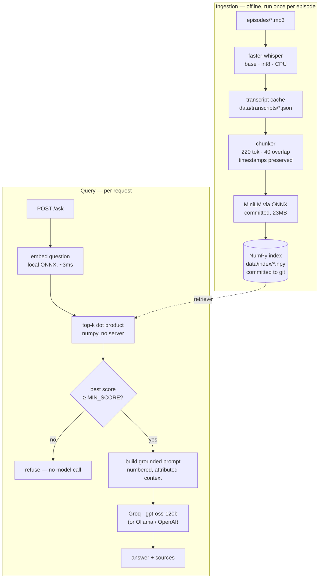

# Ask the Commit

Retrieval-augmented question answering over the *Ask the Commit* podcast archive.

Ask a question, get an answer **grounded only in the actual transcripts**, with a citation to the episode and the timestamp the answer came from.
If the archive doesn't cover it, the service says so instead of inventing an answer.

Everything runs locally except generation, which uses a free hosted open-weight model.
No paid APIs, no vendor lock-in: transcription, embeddings and the vector store are
all on your machine, and the generation backend sits behind an interface you can
point at Ollama for a fully offline setup.

```
$ curl -s localhost:8000/ask -H 'content-type: application/json' \
    -d '{"question": "Why does Kushal think privacy is a human right?"}' | jq

{
  "answer": "Kushal says he believes privacy is a human right because it is
             \u201cextremely important\u201d in today\u2019s modern world \u2014 where computers
             and new technologies constantly threaten personal data \u2014 and therefore
             people need to be reminded of its importance over and over again [1].",
  "sources": [
    { "episode": "Privacy and Surveillance - Kushal Das", "timestamp": "0:00",  "score": 0.591, "text": "..." },
    { "episode": "Privacy and Surveillance - Kushal Das", "timestamp": "35:32", "score": 0.506, "text": "..." }
  ],
  "refused": false,
  "latency_ms": 1157
}

$ curl -s localhost:8000/ask -H 'content-type: application/json' \
    -d '{"question": "What is the capital of Mongolia?"}' | jq -c '{answer, sources, refused}'

{"answer":"This isn't covered in the episodes.","sources":[],"refused":true}
```

---

## Contents

- [Architecture](#architecture)
- [Quickstart](#quickstart)
- [Configuration](#configuration)
- [API](#api)
- [Chunking approach, and why](#chunking-approach-and-why)
- [Transcription quality and domain vocabulary](#transcription-quality-and-domain-vocabulary)
- [Grounding and refusal](#grounding-and-refusal)
- [Evaluation](#evaluation)
- [Eval results](#eval-results)
- [Observability](#observability)
- [Design notes](#design-notes)
- [Testing](#testing)
- [Deploying a demo](#deploying-a-demo)
- [Limitations and next steps](#limitations-and-next-steps)
- [About the transcripts](#about-the-transcripts)

---

## Architecture

Two pipelines share one vector store. Ingestion runs offline and rarely; querying
runs per request.



Text version, for terminals:

```
 episodes/*.mp3
      │
      ▼
 faster-whisper ──► transcript cache ──► chunker ──► MiniLM ──► ┌──────────┐
  (local, CPU)      (data/transcripts)  (timestamped)  (local)  │  Chroma  │
                                                                └────┬─────┘
                                                                     │
 POST /ask ──► embed question ──► top-k cosine search ◄───────────────┘
                                        │
                                        ├── best score < MIN_SCORE ──► refuse (no model call)
                                        │
                                        └──► grounded prompt ──► Groq/Ollama/OpenAI ──► answer + sources
```

### Layering

Dependencies point one way. Only `app/factory.py` knows which concrete provider is in use.

```
ingest.py · rag.py · main.py · eval.py     entry points
        └──► app.factory                    composition root — picks providers
                └──► app.providers.*        adapters: whisper, MiniLM, chroma, openai-compatible
                        └──► app.interfaces protocols: Transcriber, Embedder, VectorStore, ChatModel
                                └──► app.models  domain types
```

### Files

| File | Role |
| --- | --- |
| `app/interfaces.py` | The four `Protocol` classes every provider implements. |
| `app/models.py` | Domain types: `Transcript`, `Chunk`, `RetrievedChunk`, `RagAnswer`. |
| `app/chunking.py` | Pure, dependency-free timestamped chunker. |
| `app/prompts.py` | System prompt, context formatting, refusal detection. |
| `app/factory.py` | Composition root and the provider registry. |
| `app/providers/` | Adapters. Light: `embeddings_remote.py`, `store_numpy.py`, `llm.py`. Ingest-only: `transcription.py`, `embeddings.py`, `store.py`. |
| `render.yaml` | Render blueprint: one free web service, no disk. |
| `requirements.txt` | Runtime only — 84MB, no ML stack. |
| `requirements-ingest.txt` | Local ingest: whisper, torch, chroma. |
| `data/index/` | The committed index: `embeddings.npy`, `chunks.json`, `manifest.json`. |
| `app/config.py` | Typed settings from env / `.env`. |
| `app/logging_config.py` | Structured JSON logging with request correlation. |
| `ingest.py` | Audio → transcript → chunks → embeddings → Chroma. |
| `rag.py` | The core loop. Also a CLI for testing without the API. |
| `main.py` | FastAPI app: `GET /` (UI), `POST /ask`, `GET /health`. |
| `app/static/index.html` | Minimal single-page query UI, no build step, no dependencies. |
| `Dockerfile.serve` | Query-only image for deployment — no whisper, no ffmpeg. |
| `DEPLOY.md` | Getting a public demo URL. |
| `eval.py` | Scored eval harness over `eval_set.json`. |

---

## Quickstart

### 0. Requirements

**Python 3.11–3.13**, and `ffmpeg` on your PATH for local runs
(`brew install ffmpeg`).

3.13 is fine: `torch` and `ctranslate2` both publish cp313 wheels, and `chromadb`
ships stable-ABI (`abi3`) wheels. 3.14 is not recommended yet — the transitive
dependency tree hasn't caught up, and you'll hit source builds. The Docker image
pins 3.11 for a reproducible environment regardless of what you have locally.

### 1. Install

```bash
python3.13 -m venv .venv && source .venv/bin/activate

# To ingest audio (needs whisper + torch). CPU-only torch first, or pip pulls
# ~2.5GB of unused CUDA libraries.
pip install torch --index-url https://download.pytorch.org/whl/cpu
pip install -r requirements-ingest.txt
```

To only *serve* an existing index, `pip install -r requirements.txt` is enough —
84MB, no ML stack, boots in 0.01s. That split is what makes a free-tier
deployment possible; see [DEPLOY.md](DEPLOY.md).

### 2. Configure

```bash
cp .env.example .env
```

Put a free key from [console.groq.com/keys](https://console.groq.com/keys) into
`GROQ_API_KEY`. Every other setting has a working default.

No key yet? Set `LLM_PROVIDER=echo` to exercise ingestion, retrieval, the API and
the eval harness with no model and no network — the "answer" is just the retrieved
context echoed back. Good for checking that retrieval works before you care about
phrasing.

### 3. Add audio

Drop files into `episodes/`. Any format ffmpeg decodes (`.mp3`, `.m4a`, `.wav`,
`.flac`, `.ogg`, `.opus`, `.mp4`, `.webm`, …), flat, no subdirectories.

**The filename stem becomes the episode name in every citation**, so
`Privacy and Surveillance - Kushal Das.mp3` cites as
`Privacy and Surveillance - Kushal Das @ 14:22`. Name them the way you want to
read them — and name them *before* ingesting, since the episode name is the index
key. Renaming afterwards orphans the old episode's chunks.

### 4. Ingest

```bash
python ingest.py                 # index everything not already indexed
python ingest.py --dry-run       # list what would be processed
python ingest.py --limit 1       # smoke-test on one episode first
python ingest.py --force         # re-chunk + re-embed (reuses cached transcripts)
python ingest.py --retranscribe  # also discard cached transcripts
```

Transcription runs at **13–16× real time** with the `base` model on an M-series
CPU — 90 minutes of audio indexed in under 6 minutes, measured on this corpus.

It is a one-time cost per episode. Transcripts are cached as JSON, so re-indexing
with different chunk settings never re-transcribes — the run below re-chunked all
three episodes from cache in **0.9 seconds**:

```
EPISODE                                    STATUS    CHUNKS  AUDIO     ELAPSED
AI-Generated Music - Mateusz Modrzejewski  indexed       31    31.8m      0.3s
Inside PyPI Support - Maria Ashna          indexed       19    17.3m      0.2s
Privacy and Surveillance - Kushal Das      indexed       46    41.0m      0.4s

3 episode(s) indexed | 96 chunks in the store
```

### 5. Test the core loop

Before touching the API:

```bash
python rag.py "Why does Kushal think privacy is a human right?"
python rag.py --top-k 8 --json "How do diffusion models produce audio?"
```

### 6. Run the API

```bash
uvicorn main:app --reload
```

- <http://localhost:8000/> — the query UI
- <http://localhost:8000/docs> — generated OpenAPI docs

The UI is a single dependency-free HTML file served from `app/static/`. It shows
the answer, the sources with episode and timestamp, per-stage latency, and a row
of example questions — a visitor who has never heard the podcast otherwise has no
idea what to ask.

### Docker

```bash
docker compose run --rm ingest      # one-shot: transcribe + index episodes/
docker compose up --build           # start the API on :8000
```

`episodes/` is mounted read-only, `data/` holds the index and transcript cache, and
model weights live in a named volume so they're downloaded once and survive rebuilds.

---

## Configuration

Everything is env-driven; see `.env.example` for the full annotated list.

| Variable | Default | Notes |
| --- | --- | --- |
| `LLM_PROVIDER` | `groq` | `groq` · `ollama` · `openai` · `echo` |
| `GROQ_API_KEY` | — | Free from console.groq.com |
| `GROQ_MODEL` | `openai/gpt-oss-120b` | Groq's free lineup changes; check `/v1/models` for what your key can reach |
| `WHISPER_MODEL` | `base` | `tiny`→`large-v3`; bigger is slower and better |
| `WHISPER_INITIAL_PROMPT` | unset | Domain vocabulary that biases transcription — see [transcription quality](#transcription-quality-and-domain-vocabulary) |
| `EMBEDDING_PROVIDER` | `onnx` | `onnx` (local, committed model, no key) · `local` (sentence-transformers) · `jina` · `google` · `openai` |
| `EMBEDDING_API_KEY` | — | Only for the hosted providers; `onnx` and `local` need none |
| `EMBEDDING_MODEL` | provider default | Blank uses the provider's default |
| `VECTOR_STORE` | `numpy` | `numpy` (committed, read-only) or `chroma` (local dev) |
| `CHUNK_TOKENS` | `500` (this deployment runs `220`) | See [chunking](#chunking-approach-and-why) — 220 keeps chunks inside the encoder window |
| `CHUNK_OVERLAP_TOKENS` | `50` | |
| `TOP_K` | `5` | Chunks retrieved per question |
| `MIN_SCORE` | `0.20` | Cosine floor below which the service refuses without calling the model |
| `LOG_FORMAT` | `json` | `text` for readable local development |

### Swapping providers

Fully offline, no API key:

```bash
ollama pull llama3.1:8b
LLM_PROVIDER=ollama python rag.py "Why does Kushal think privacy is a human right?"
```

Adding a backend that isn't OpenAI-compatible (Anthropic, Bedrock, llama.cpp's
native server) means writing one class with a `complete(*, system, user) -> str`
method and adding a line to `CHAT_BUILDERS` in `app/factory.py`. Nothing in
`rag.py`, `main.py` or `eval.py` changes — none of them import a provider.

---

## API

### `POST /ask`

```json
{ "question": "Why does Kushal think privacy is a human right?", "top_k": 5 }
```

`top_k` is optional and overrides the configured default.

```json
{
  "question": "Why does Kushal think privacy is a human right?",
  "answer": "He says privacy is extremely important in the modern world [1].",
  "sources": [
    {
      "episode": "Privacy and Surveillance - Kushal Das",
      "timestamp": "35:32",
      "start_seconds": 2132.4,
      "end_seconds": 2189.8,
      "score": 0.5056,
      "chunk_id": "privacy-and-surveillance-kushal-das:00040",
      "text": "…the full chunk text…"
    }
  ],
  "refused": false,
  "model": "groq:openai/gpt-oss-120b",
  "request_id": "9f2c1ab4e7d0",
  "latency_ms": 812.4,
  "retrieval_ms": 41.2,
  "generation_ms": 769.8
}
```

When the archive doesn't cover the question, `refused` is `true`, `sources` is
empty, and `answer` is exactly `This isn't covered in the episodes.`

| Status | Meaning |
| --- | --- |
| `200` | Answered, or cleanly refused |
| `422` | Malformed question |
| `502` | Generation backend unreachable after retries |
| `503` | Misconfigured (e.g. `LLM_PROVIDER=groq` with no key) |

Pass `x-request-id` to correlate your logs with the service's; it's echoed on the
response and stamped on every log line for that request.

### `GET /health`

```json
{
  "status": "ok",
  "version": "0.1.0",
  "indexed_chunks": 96,
  "indexed_episodes": 3,
  "embedding_model": "sentence-transformers/all-MiniLM-L6-v2",
  "llm": "groq:openai/gpt-oss-120b"
}
```

`status` is `degraded` when the index is empty — the service is up, but every
question would be refused until `ingest.py` has run.

---

## Chunking approach, and why

Chunking is where most RAG quality is won or lost, so the reasoning is explicit.

### Segments are the atomic unit

faster-whisper emits sentence-ish segments, each with its own start and end time.
The chunker packs **whole segments** into chunks rather than splitting on a
character or token count.

Two things fall out of that:

- Every chunk boundary lands on a natural pause, so no chunk starts mid-clause.
  Retrieval on a half-sentence is noticeably worse — the fragment reads as
  gibberish to the encoder *and* to the reader who clicks through to the citation.
- A chunk's `start` is a **real timestamp from the audio**, not an interpolation.
  The citation `Privacy and Surveillance - Kushal Das @ 35:32` is a spot you can
  actually seek to in the audio.

The one exception is a segment longer than the chunk budget, which gets split on
word boundaries with linearly interpolated timestamps. It's rare — whisper
segments run a few seconds — but without it that segment would produce a chunk the
encoder silently truncates.

### Sizes are measured in the embedding model's own tokens

`chunk_tokens` is counted with the tokenizer of the model doing the embedding, not
in characters or whitespace words. This means the number in your config is the same
number the model sees. The chunker takes the counting function as a parameter, so
it stays pure and unit-testable with no model loaded.

### Overlap carries trailing segments

The last ~50 tokens of each chunk are repeated at the head of the next. Answers
that straddle a boundary — a question at the end of one chunk, the answer at the
start of the next — survive in at least one chunk intact. The carry-over always
drops at least one segment, which guarantees the window advances even when a
single segment nearly fills a whole chunk.

### Why ~500/50 — and the caveat that matters

500 tokens is roughly 3–4 minutes of speech: long enough for a complete thought
with its setup, short enough that a retrieved chunk is one topic rather than three.
Podcast speech is low-density — a 200-token chunk of conversational audio often
contains one exchange and no actual claim — which argues for larger chunks than
you'd use over written documentation. 10% overlap is the standard starting point
and there's no evidence in this corpus for tuning it further yet.

> [!IMPORTANT]
> **`all-MiniLM-L6-v2` truncates its input at 256 word-piece tokens.** With
> `CHUNK_TOKENS=500`, the back half of every chunk contributes *nothing* to the
> vector. That text is still stored, still returned in citations, and still fed to
> the LLM as context — but it is invisible to search. A question only answerable by
> the tail of a chunk will not retrieve it.
>
> `ingest.py` logs a `chunking.exceeds_embedder_context` warning when this applies.
>
> **Recommended: `CHUNK_TOKENS=220`, `CHUNK_OVERLAP_TOKENS=40`** — the whole chunk
> fits inside the encoder's window, so every word is searchable. 500/50 is kept as
> the shipped default only because it was the specified starting point; the eval
> harness exists precisely to settle this on your corpus rather than by argument.
>
> Changing it costs seconds, not hours — transcripts are cached, so
> `CHUNK_TOKENS=220 python ingest.py --force` re-chunks and re-embeds without
> re-transcribing.

If you want chunks longer than 256 tokens *and* full-chunk searchability, swap the
embedder for one with a larger window — `BAAI/bge-small-en-v1.5` (512 tokens,
384-dim, same speed class) is a drop-in: change `EMBEDDING_MODEL` and re-run
`ingest.py --force`.

---

## Transcription quality and domain vocabulary

Retrieval and generation can only be as good as the transcript. Whisper resolves
ambiguous audio to the **most probable general-English** spelling, which is
reliably wrong for technical proper nouns:

| Audio | `base` | `small` | `small` + vocabulary |
| --- | --- | --- | --- |
| "Qubes OS" | cubes OS | cubes OS | **Qubes OS** |
| "via Tor" | to Viator | to Viator | **via Tor** |
| "the Tor Project" | a tour project | **the Tor Project** | **the Tor Project** |
| "CPython" | C Python | **CPython** | **CPython** |

A bigger model fixes some of these — `small` recovers "Tor Project" and "CPython"
that `base` mangled — but it cannot fix a true homophone. "Qubes" and "cubes" are
acoustically identical; no amount of model capacity decides between them, because
the decision is about vocabulary, not audio.

`WHISPER_INITIAL_PROMPT` is the fix. faster-whisper accepts a prompt (~224 tokens)
that conditions decoding, so naming the domain's terms makes them available as
candidates:

```bash
WHISPER_INITIAL_PROMPT="Qubes OS, Tails, Tor Project, SecureDrop, CPython, PyPI,
PEP 541, Cheese Shop, librosa, Pedalboard, ISMIR, NIME, neural codec, diffusion models."
```

It also improves punctuation, since the prompt establishes a written register.

The prompt is part of the transcriber's cache identity
(`faster-whisper:small+v9fb7bb8f`), so changing the vocabulary invalidates cached
transcripts exactly as changing the model does — you cannot accidentally serve a
mix of two vocabularies.

**Cost:** re-transcription, since this changes decoding rather than
post-processing. Roughly 20 minutes for 90 minutes of audio with `small`.

---

## Grounding and refusal

Three independent mechanisms keep answers tied to the transcripts:

1. **The prompt.** Context is numbered and attributed (`[1] episode: … | time: …`),
   the model is told to use only those excerpts, cite every claim inline, and reply
   with one exact sentence when the context falls short. The question is repeated
   *after* the context, because instruction adherence degrades when the ask is
   buried above a long block of text.

2. **A retrieval floor.** If the best-matching chunk scores below `MIN_SCORE`
   (default 0.20 cosine), the pipeline refuses immediately and never calls the
   model. This is both a quality guard and a cost guard: an obviously-unanswerable
   question shouldn't spend a generation call to arrive at the same refusal. Set
   `MIN_SCORE=-1` to always generate.

3. **Refusal detection.** `is_refusal()` matches the refusal sentence loosely
   (case, punctuation, curly vs straight apostrophe), and a refused answer has its
   `sources` cleared — the API never attaches citations to a non-answer. The full
   retrieval trace is still kept on `RagAnswer.retrieved` for the eval harness and
   for debugging.

Grounding is a mitigation, not a guarantee. A model can still misread a
transcript, and speech-to-text can mishear a name or a number. The citations exist
so a reader can check.

---

## Evaluation

`eval.py` separates the two failure modes a RAG system actually has:

- **Retrieval** — did a chunk that contains the answer make it into the context at
  all? If not, no prompt tweak will help; the fix is chunking, `TOP_K`, or the
  embedding model.
- **Generation** — given a context that *did* contain the answer, did the model say
  it? If retrieval is fine and answers aren't, the fix is the prompt or the model.

Conflating those is how people spend a week tuning a prompt to fix a chunking bug.

### The eval set

`eval_set.json` is a list of cases:

```json
[
  {
    "question": "What was PyPI formerly known as, and where did the name come from?",
    "expected_answer_contains": ["Cheese Shop"],
    "expected_episode": "Inside PyPI Support - Maria Ashna",
    "expect_refusal": false
  },
  {
    "question": "What is the capital of Mongolia?",
    "expected_answer_contains": [],
    "expect_refusal": true
  }
]
```

| Field | Meaning |
| --- | --- |
| `question` | The question to ask. |
| `expected_answer_contains` | Substrings the answer must **all** contain (case-insensitive). A bare string is accepted. |
| `expected_episode` | Optional. Retrieval passes if this episode is among the retrieved chunks. |
| `expect_refusal` | `true` for out-of-scope questions. Retrieval isn't graded; the case passes only if the system declines. |

The shipped file has **14 cases over the three indexed episodes**: 10 content
questions and 4 out-of-scope probes. Two of those probes are deliberately
*near*-misses — "What does Kushal Das think about Rust?" retrieves genuinely
related chunks about programming — because that is where over-eager answering
shows up. A refusal set of only absurd questions ("capital of Mongolia") proves
very little.

### Running it

```bash
python eval.py                       # scored table
python eval.py --markdown            # Markdown table to paste below
python eval.py --json results.json   # full per-case output
python eval.py --top-k 8             # sweep retrieval depth
```

```
     RETR  ANS  SCORE       MS  QUESTION
PASS hit   ok   0.6847     719  How do diffusion models actually produce audio?
FAIL hit   no   0.4139    9231  What operating system do journalists use for handli
PASS n/a   ok   0.0889      24  What is the capital of Mongolia?

--- summary ---
cases              : 14 (0 errored)
retrieval recall@k : 100%  (10 graded)
answer accuracy    : 93%
refusal rate       : 29%
mean top score     : 0.4639
latency p50 / mean : 9569.4 ms / 6974.2 ms
```

Retrieval grading uses substring matching against retrieved chunk text, which is a
proxy: it under-counts paraphrase, so treat retrieval recall as a floor. The
trade-off buys an eval set you can extend in thirty seconds without labelling
chunk IDs, which matters more early on than precision in the metric.

---

## Eval results

**Corpus:** 3 episodes · 90 minutes of audio · 96 chunks
**Config:** `WHISPER_MODEL=small` + domain vocabulary prompt · `CHUNK_TOKENS=220` ·
`CHUNK_OVERLAP_TOKENS=40` · `TOP_K=5` · `MIN_SCORE=0.20` ·
`EMBEDDING_PROVIDER=onnx` · `GROQ_MODEL=openai/gpt-oss-120b`

| Metric | Result |
| --- | --- |
| **Retrieval recall@5** | **100%** (10/10 graded) |
| **Answer accuracy** | **100%** (14/14) |
| Correct refusals | 4/4 |
| Mean top score | 0.486 |
| Errors | 0 |

| Question | Retrieval | Answer | Top score |
| --- | --- | --- | --- |
| What are the main neural network architectures used for music generation? | hit | pass | 0.568 |
| How do diffusion models actually produce audio? | hit | pass | 0.729 |
| Which Python libraries are recommended for working with audio and music? | hit | pass | 0.693 |
| What is the concern about copyright for working musicians? | hit | pass | 0.640 |
| What was PyPI formerly known as, and where did the name come from? | hit | pass | 0.490 |
| How long does it take to triage a PyPI account recovery request? | hit | pass | 0.646 |
| Is PyPI Orgs a commercial product? | hit | pass | 0.561 |
| Why does Kushal Das believe privacy is a human right? | hit | pass | 0.628 |
| What operating system do journalists use for handling sensitive documents? | hit | pass | 0.363 |
| What is chat control and why is it a concern in Europe? | hit | pass | 0.469 |
| What is the capital of Mongolia? | n/a | pass | 0.118 |
| What did they say about the 2031 Martian tax code? | n/a | pass | 0.278 |
| What does Kushal Das think about the Rust programming language? | n/a | pass | 0.292 |
| How much revenue did the podcast make last quarter? | n/a | pass | 0.321 |

### How it got there

The final number is less interesting than the sequence. Each row is a measured
run, not an estimate:

| # | Change | Answer accuracy | What it taught |
| --- | --- | --- | --- |
| 1 | `base`, 500/50 chunks | — | Chunks exceeded MiniLM's 256-token window; 12 chunks for a 32-minute episode. Never evaluated — the defect was visible from the ingest log. |
| 2 | `base`, 220/40 chunks | 93% | 38 → 95 chunks. Every chunk now fully searchable. Retrieval hit 100% immediately. |
| 3 | Honour `Retry-After` on 429 | 93% | Not a quality change — 7/14 cases had been *erroring*, not failing. Exponential backoff waited 1s against a limit asking for 9s. |
| 4 | Unicode-fold eval grading | 93% | Two "failures" were the grader's fault: the model writes `Cheese Shop` with a narrow no-break space and `open‑source` with U+2011. |
| 5 | `small` model | **93%** | **No measurable gain.** Fixed "a tour project" → "the Tor Project" and "C Python" → "CPython", but the eval did not test those, and it did not fix the one case that was failing. |
| 6 | Vocabulary prompt | **100%** | Fixed "cubes OS" → "Qubes OS" and "to Viator" → "via Tor". |
| 7 | Hosted embedding API (deployment) | 100% | Moved question embedding off-box so the runtime could drop torch. Worked, but added a second API key and ~60ms per query. |
| 8 | Local ONNX embedder | **100%** | Same model as step 7's fallback, no torch, no API key. Retrieval 60ms → **3ms**, mean top score 0.481 → 0.486, RSS 192MB. |

Step 8 came from asking why a hosted embedder was needed at all. The honest
answer was that torch does not fit 512MB — but that was a constraint on *torch*,
not on running the model. ONNX Runtime executes the same MiniLM in 192MB, which
removed an entire external dependency from the deployment.

It also surfaced a subtle bug worth knowing about: the int8 export uses dynamic
quantisation, so batching made each vector depend on its batch-mates — the same
sentence scored only 0.980 cosine against itself when embedded alongside a
different one. Since the index is built in bulk and questions arrive singly, that
would have quietly skewed every similarity score. Encoding one text at a time
restores exact self-consistency at a cost of ~3s per index build.

Step 5 is the other one to dwell on. The obvious fix for a transcription error is
a bigger model, and it cost 20 minutes of CPU to learn that it changed nothing
here. "Qubes" and "cubes" are homophones — model capacity was never the bottleneck,
vocabulary was. A 40-second clip A/B test established that in well under a minute,
and should have come first.

### Reading these numbers

**100% on 14 cases is a small-sample result**, not a claim about the system in
general. The corpus is 96 chunks; retrieval gets harder with 30 episodes, not 3.
What the eval does establish is that there is no *systematic* failure left in the
pipeline — the remaining risk is coverage, which means more cases.

**All four refusals were correct**, including two deliberate near-misses. "What
does Kushal Das think about Rust?" retrieves genuinely related chunks — he is a
CPython core developer discussing programming, top score 0.276 — and the system
still declines. Related is not the same as answering.

**Latency here is not real latency.** The p50 of ~10s is dominated by Groq
free-tier rate limiting (8,000 tokens/minute, ~2,000 per query), so the harness
spends most of its wall clock honouring `Retry-After`. Unthrottled, generation
takes **~700ms** and retrieval ~40ms once the embedder is warm — see the 680ms and
658ms rows, which ran before the token bucket emptied.

### Experiments still worth running

1. **More eval cases.** 100% on 14 is the weakest part of this result. Thirty
   cases across more episodes would say something the current set cannot.
2. `TOP_K` 5 → 3, which nearly halves prompt tokens. Retrieval recall is 100% at
   k=5, so there is likely headroom to trade — and it doubles the queries the
   free tier allows.
3. `MIN_SCORE` sweep — 0.20 currently produces zero false refusals, but the
   near-miss cases score up to 0.33, so the margin is thinner than it looks.
4. `EMBEDDING_MODEL` → `BAAI/bge-small-en-v1.5` (512-token window, same speed
   class) to allow longer chunks without truncation.
5. Hybrid BM25 + dense retrieval, which should help exact-match queries on the
   proper nouns these episodes are full of.

---

## Observability

Every log line is a single JSON object with a stable `event` key and a
`request_id` that ties a request's lines together. `LOG_FORMAT=text` gives
readable output while developing.

One record per query carries everything needed to debug a bad answer:

```json
{
  "ts": "2026-08-19T21:56:31+0000",
  "level": "INFO",
  "event": "query.completed",
  "request_id": "21a1bcdfc40f",
  "question": "Why does Kushal think privacy is a human right?",
  "model": "groq:openai/gpt-oss-120b",
  "top_k": 5,
  "scores": [0.5906, 0.5056, 0.4327, 0.4075, 0.3684],
  "top_score": 0.5906,
  "chunks_used": [
    "privacy-and-surveillance-kushal-das:00000",
    "privacy-and-surveillance-kushal-das:00040",
    "privacy-and-surveillance-kushal-das:00031"
  ],
  "episodes": ["Privacy and Surveillance - Kushal Das"],
  "retrieval_ms": 41.2,
  "generation_ms": 1157.1,
  "total_ms": 1198.3,
  "refused": false,
  "short_circuited": false,
  "answer_chars": 262
}
```

`chunks_used` makes any answer reproducible after the fact — you can pull the exact
chunks back out of Chroma by ID and see what the model was actually shown.

Other notable events: `ingest.completed`, `transcribe.completed` (with
`realtime_factor`), `transcript.cache_hit`, `chunking.exceeds_embedder_context`,
`store.upserted`, `generation.attempt_failed`, `http.request`, `eval.completed`.

Useful one-liners:

```bash
# slowest queries
grep query.completed logs.jsonl | jq -s 'sort_by(-.total_ms) | .[:10] | .[] | {q:.question, ms:.total_ms}'

# what got refused, and how weak retrieval was
grep query.completed logs.jsonl | jq 'select(.refused) | {q:.question, top:.top_score}'
```

---

## Design notes

**Providers sit behind `Protocol` classes.** `Transcriber`, `Embedder`,
`VectorStore` and `ChatModel` are structural protocols in `app/interfaces.py`.
Adapters don't import or inherit from anything there, so the dependency arrow
points one way, and `rag.py` has no idea Groq exists. The payoff shows up in the
tests: the entire retrieve→prompt→generate loop is tested with in-memory fakes —
no model downloads, no database, no network, sub-second.

**One composition root.** `app/factory.py` is the only module that names a
concrete provider. Swapping Chroma for pgvector touches one function.

**Transcription is cached separately from the index.** It's 99% of the ingest cost
and completely independent of chunking. Caching transcripts as JSON turns "try a
different chunk size" from an overnight job into a coffee break, which is the
difference between tuning chunking and just not tuning it.

**Deterministic chunk IDs.** `<episode-slug>:<index>` makes re-ingestion
idempotent — re-running `ingest.py --force` replaces an episode's chunks instead of
duplicating them, and stale chunks are deleted first so a shorter re-chunk can't
leave orphans behind.

**The chunker is pure.** It takes segments and a counting function and returns
chunks. No I/O, no model, no config object — which is why it has the densest test
coverage in the project.

**Blocking work runs off the event loop.** Embedding and the generation HTTP call
both block; `/ask` runs the pipeline in a threadpool so one slow query doesn't stall
every other request in the process.

**Models load lazily and are warmed at startup.** Importing a module never loads a
model, so tests and `--help` stay fast, but the API warms the embedder during
startup so the first real request isn't the slow one.

---

## Testing

```bash
pip install -r requirements-dev.txt
pytest                    # 108 tests, ~1.6s, no network
ruff check .
mypy
```

The whole suite runs on the **runtime** dependency set — no torch, no chromadb,
no faster-whisper — because every provider is faked behind its protocol. That is
the abstraction paying rent: CI needs a 196MB environment, not a 2GB one. The
ONNX embedder tests are the only ones that load a real model, and it is the 23MB
one committed to the repo.

Coverage focuses on the parts where bugs are silent rather than loud:

| Area | What's covered |
| --- | --- |
| `test_chunking.py` | Token budgets, timestamp monotonicity, overlap, oversized segments, blank segments, the pathological near-max segment that could stall the window. |
| `test_rag.py` | Grounded answers, prompt contents, the `MIN_SCORE` short-circuit (asserts *no* model call is made), empty index, refusal clearing sources while keeping the retrieval trace. |
| `test_api.py` | `/ask`, `/health` and `/` contracts, `top_k` override, validation, request-id echo, generation failure → 502, UI fallback when the static asset is absent. |
| `test_ingest.py` | Episode discovery, cache hit/miss, cache invalidation when the transcriber or its vocabulary prompt changes. |
| `test_prompts.py` | Context formatting, refusal detection across apostrophe and punctuation variants, timestamp formatting. |
| `test_store_numpy.py` | Ranking, query normalisation, upsert-by-id, the read-only guard, a corrupted index, and the embedder-mismatch check. |
| `test_embeddings_remote.py` | Request shape, out-of-order responses, batching, dimension and zero-vector rejection, retry on 429 but not on 401 — all against `httpx.MockTransport`, no network. |
| `test_embeddings_onnx.py` | Unit-length output, determinism, mask-weighted pooling, exact token counting — and that a text's vector does not change with what it is embedded alongside, which regressed once. |
| `test_eval.py` | Eval-set parsing, retrieval vs answer grading, refusal cases, summary maths. |

The Chroma and faster-whisper adapters are thin translation layers over third-party
APIs and are exercised by running `ingest.py`, not by unit tests — mocking them
would only assert that the mocks match my assumptions.

---

## Deploying a demo

See **[DEPLOY.md](DEPLOY.md)** for step-by-step Render instructions. The design
in one paragraph:

The deployed service does **no local inference and no disk writes**. Transcription
and index building run on your machine; the service ships a committed NumPy index
(~250KB for 96 chunks), memory-maps it read-only, embeds the incoming question
through an HTTP API, and takes a dot product. `requirements.txt` therefore holds
no torch, no sentence-transformers and no chromadb — 84MB total, booting in
**0.01s**, which is what makes a free tier viable at all.

| Concern | How it is handled |
| --- | --- |
| No persistent disk | The store is opened `read_only=True`; every write path raises rather than silently vanishing on redeploy |
| `$PORT` injected by the host | The start command passes it to uvicorn; never hardcoded |
| Missing credentials | Startup aborts with a list of exactly which variables are unset and where to get them |
| Wrong embedder for the index | `manifest.json` records what built the index; boot fails on mismatch, because the alternative is silently bad retrieval |
| Idle spin-down | `/health` answers from a dict cached at startup in ~1.3ms, touching neither index nor API, so an external pinger is free |

> [!WARNING]
> `/ask` has no authentication, so a public link spends your Groq quota —
> measured at 8,000 tokens/minute and 1,000 requests/day, about 4 questions a
> minute. Fine for a link sent to a few interviewers. DEPLOY.md lists the fixes
> if it spreads further.

---

## Limitations and next steps

Known and deliberate, roughly in the order I'd address them:

- **Retrieval is pure dense vector search.** No reranking, no hybrid BM25. Dense
  retrieval is weak on exact-match queries — proper nouns, product names, numbers —
  which podcasts are full of. Hybrid search plus a cross-encoder reranker is the
  single biggest quality lever left.
- **No speaker attribution.** Chunks record *when* something was said, not *who*
  said it, so "what did the guest think?" can't be answered precisely.
  Diarization (`pyannote.audio`) would fix this and slot in at the transcript layer.
- **500-token chunks exceed the encoder's window** at the shipped default — see
  [chunking](#chunking-approach-and-why).
- **Speech-to-text still bounds the ceiling.** `small` plus a domain vocabulary
  prompt handles this corpus, but any term absent from the prompt and ambiguous
  in audio will be transcribed wrong, and everything downstream inherits it.
  Maintaining the vocabulary list is manual.
- **Single-turn only.** No conversation history, so follow-ups like "what about the
  other one?" don't resolve.
- **No authentication or rate limiting** on the API. Fine behind a private network,
  not fine on the open internet.
- **`GET /health` scans collection metadata** to count episodes. Fine at podcast
  scale; it would need a cached counter at millions of chunks.
- **Ingestion is single-process and serial.** Episodes could be transcribed in
  parallel across cores.

---

## About the transcripts

The index in this repository (`data/index/`) contains machine-generated
transcript excerpts from three published podcast episodes, included so the
retrieval demo actually works against real material rather than toy data.

**They are automatic speech-to-text output, not an edited record.** They were
produced by `whisper small` and have not been proofread. Known errors have been
corrected where the evaluation surfaced them — "Qubes OS" and "the Tor Project"
were both mis-transcribed before a domain vocabulary prompt was added — but at
roughly 17,000 words, others certainly remain. **Do not quote them as what a
guest said.** Go to the episode audio for that.

The words belong to the people who spoke them:

| Episode | Guest |
| --- | --- |
| AI-Generated Music | Mateusz Modrzejewski |
| Inside PyPI Support | Maria Ashna |
| Privacy and Surveillance | Kushal Das |

The code here is MIT-licensed and free to reuse. The transcripts are not — see
[LICENSE](LICENSE). If you want to quote a guest, ask them.
